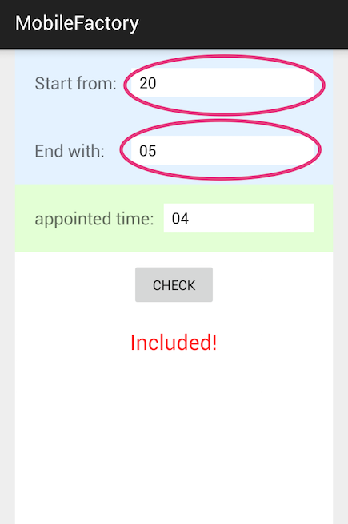
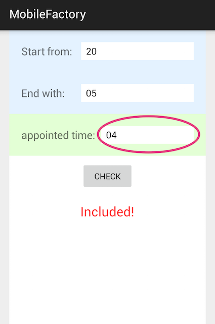
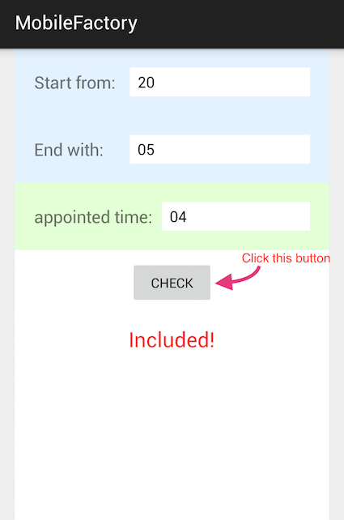

# MobileFactory User Guide

## Installation

Please download apk file from [https://goo.gl/X2c5YO](https://goo.gl/X2c5YO)

or scan following QR code directly.

then open the apk file and install the application.

Note that this application only support Android 4.0+.

  

## Usage

### set up the start and end time

### appoint the time you want check

### click the button, and the result will show below

- **"Included"** means the appointed time is between the start time and end time.
- **"Not Included"** means the appinted time is not included in the time period.

